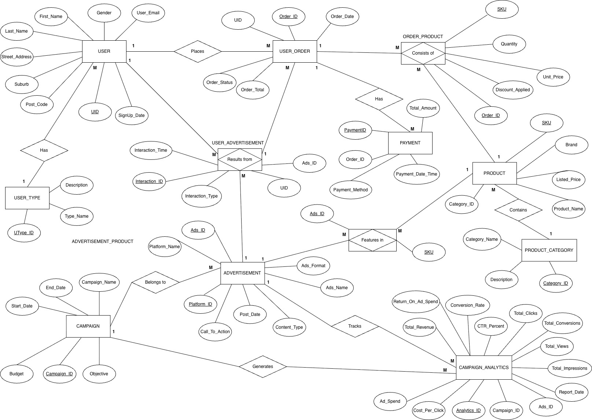

# Retail Marketing Analytics Database (SQL)

A relational database built for a retail marketing case study. It traces the full customer journey, from seeing a social media ad to buying a product, so marketing leaders can see which campaigns, platforms and ads actually drive revenue.

**Tools:** SQL · Entity Relationship Diagram (ERD) design
**Data:** Sample data created for the case study (20 customers, 5 campaigns, 15 ads, 22 products, 25 orders). **It is not real company data.**

---

## The business problem

A department store's Chief Marketing Officer wants to know:

1. Which social media platform gets the highest click-through rate (CTR)?
2. Which campaigns return the most revenue for their budget?
3. Which products and categories sell best during the End of Financial Year (EOFY) sale?
4. Do premium customers engage with ads more than new customers?
5. Which individual ads give the best return on ad spend (ROAS) and cost per click (CPC)?

---

## Database design



**12 tables:** `USER`, `USER_TYPE`, `USER_ORDER`, `ORDER_PRODUCT`, `PRODUCT`, `PRODUCT_CATEGORY`, `PAYMENT`, `ADVERTISEMENT`, `USER_ADVERTISEMENT`, `ADVERTISEMENT_PRODUCT`, `CAMPAIGN`, `CAMPAIGN_ANALYTICS`

**Key design decisions**

- **Ad attribution.** `USER_ADVERTISEMENT` records every view and click, so ad interactions can be linked to later orders. That shows which ads actually drive revenue.
- **Many-to-many links.** User ↔ Ad, Order ↔ Product and Ad ↔ Product are resolved with linking (associative) tables.
- **No duplicated categories.** `PRODUCT_CATEGORY` is its own table, so changing a category means updating one row.
- **Separate payments table.** `PAYMENT` supports split and instalment payments, such as Afterpay.
- **Separate reporting table.** `CAMPAIGN_ANALYTICS` stores pre-calculated KPIs (CTR, ROAS, CPC, conversion rate) apart from day-to-day operational data, so dashboard queries stay fast and simple.
- **Avoided reserved words.** The orders table is named `USER_ORDER` because `ORDER` is a reserved word in SQL.

---

## Example query: CTR by platform

```sql
SELECT
    a.Platform_Name,
    COUNT(ua.Interaction_ID) AS Total_Interactions,
    SUM(CASE WHEN ua.Interaction_Type = 'Click' THEN 1 ELSE 0 END) AS Total_Clicks,
    ROUND(100.0 * SUM(CASE WHEN ua.Interaction_Type = 'Click' THEN 1 ELSE 0 END)
          / COUNT(ua.Interaction_ID), 2) AS CTR_Percent
FROM ADVERTISEMENT a
JOIN USER_ADVERTISEMENT ua ON a.Ads_ID = ua.Ads_ID
GROUP BY a.Platform_Name
ORDER BY CTR_Percent DESC;
```

All five analysis queries are in [`sql/03_analysis_queries.sql`](sql/03_analysis_queries.sql).

---

## Insights (from the sample data)

| Question | Finding | Recommendation |
|---|---|---|
| CTR by platform | Instagram had the highest CTR. X had none. | Move X budget to Instagram's visual formats. |
| Campaign ROI | The EOFY campaign returned the most revenue for its budget. Spring Launch returned the least. | Review Spring Launch targeting. Retarget users who clicked but didn't buy. |
| Top products | Leather tote and wool coat led EOFY revenue. Jewellery sold as an add-on. | Feature the top items in ads. Bundle jewellery with outerwear. |
| Engagement by segment | Premium customers clicked most. New customers didn't click at all. | Run a dedicated onboarding ad sequence for new customers. |
| ROAS by ad | The EOFY Instagram Story had the highest ROAS. The X Promoted Tweet produced no revenue. | Stop the X ads and reallocate the spend. |

---

## Repository structure

```
├── sql/
│   ├── 01_create_tables.sql     # Creates the 12 tables
│   ├── 02_sample_data.sql       # Inserts the sample data
│   └── 03_analysis_queries.sql  # Answers the five business questions
├── images/
│   └── erd.jpg
└── README.md
```

## How to run it

Run the three files in order (01, 02, then 03) in a SQL database such as SQLite or MySQL. Each query in step 03 returns one results table.

---

*Nouviboth Ra · [LinkedIn](https://www.linkedin.com/in/nbothra)*
